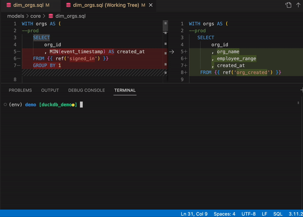

import Tabs from '@theme/Tabs';
import TabItem from '@theme/TabItem';


## Develop dbt models faster by testing as you code.

### See how every change to dbt code affects the data produced in the modified model and downstream.

:::tip Team Cloud
🔧 Interested in adding Datafold Team Cloud to your CI pipeline? [Let's talk!](https://calendly.com/d/zkz-63b-23q/see-a-demo?email=clay%20analytics%40datafold.com&first_name=Clay&last_name=Moeller&a1=) ☎️
:::

<br />
<div align="center">
    <iframe
      width="640"
      height="414"
      src="https://www.loom.com/embed/ad3df969ba6b4298939efb2fbcc14cde"
      frameborder="0"
      webkitallowfullscreen
      mozallowfullscreen
      allowfullscreen
      >
    </iframe>
</div>
<br />

## What is data-diff?

data-diff is an open source package that you can use to see the impact of your dbt code changes on your dbt models as you code.



### Install data-diff

Navigate to your dbt project, and install data-diff and a database connector.

<Tabs
  defaultValue="snowflake"
  values={[
    {label: 'Snowflake', value: 'snowflake'},
    {label: 'BigQuery', value: 'bigquery'},
    {label: 'Redshift', value: 'redshift'},
    {label: 'PostgreSQL', value: 'postgres'},
    {label: 'Databricks', value: 'databricks'},
    {label: 'DuckDB', value: 'duckdb'},
  ]}>
  <TabItem value="snowflake">

  ```zsh
  pip install data-diff 'data-diff[snowflake]' -U
  ```

  </TabItem>
  <TabItem value="bigquery">

  ```zsh
pip install data-diff google-cloud-bigquery -U
  ```
  <details>
    <summary>Additional BigQuery details</summary>
    Only dbt projects that use the <a href="https://docs.getdbt.com/reference/warehouse-setups/bigquery-setup#oauth-via-gcloud">OAuth via gcloud</a> connection method are currently supported.
    <br/> <br/>
    For example, run: <br/> <code>gcloud auth application-default login</code> <br/>
    <br/>
    Before running: <br/> <code>dbt run --select &lt;MODEL&gt; && data-diff --dbt</code> <br/>
  </details>

  </TabItem>
  <TabItem value="redshift">

  ```zsh
  pip install data-diff 'data-diff[redshift]' -U
  ```

  </TabItem>
  <TabItem value="postgres">

  ```zsh
  pip install data-diff 'data-diff[postgres]' -U
  ```

  </TabItem>
  <TabItem value="databricks">

  ```zsh
  pip install data-diff 'data-diff[databricks]' -U
  ```

  </TabItem>
  <TabItem value="duckdb">

  ```zsh
  pip install data-diff 'data-diff[duckdb]' -U
  ```

  </TabItem>
</Tabs>

### Configure your dbt project
:::info
These docs reflect the latest version of data-diff listed [here](https://github.com/datafold/data-diff/releases)!

Run `pip install data-diff -U` to update!
:::

Add the following variables to **dbt_project.yml**:

  ```yaml
  #dbt_project.yml
  vars:
    data_diff:
      prod_database: my_default_database # default database for the prod target
      prod_schema: my_default_schema # default schema for the prod target
      prod_custom_schema: PROD_<custom_schema> # Optional: see dropdown below
  ```
<details>
  <summary>Additional schema variable details</summary>
  The value for <code>prod_custom_schema:</code> will vary based on how you have setup dbt.<br/><br/>

  This variable is used when a model has a custom schema and becomes <b><i>dynamic</i></b> when the string literal <code>&lt;custom_schema&gt;</code> is present. The <code>&lt;custom_schema&gt;</code> substring is replaced with the custom schema for the model in order to support the various ways schema name generation can be overridden <a href="https://docs.getdbt.com/docs/build/custom-schemas">here</a> -- also referred to as "advanced custom schemas".
  <h3>Examples (not exhaustive)</h3>
  <br/>
  <b>Single production schema</b><br/>
  <i>If your prod environment looks like this ...</i><br/>
  <code>PROD.ANALYTICS</code><br/>
  <i>... your data-diff configuration should look like this:</i><br/>
  <code>
  vars:<br/>
    &nbsp;&nbsp;data_diff:<br/>
      &nbsp;&nbsp;&nbsp;&nbsp;prod_database: PROD<br/>
      &nbsp;&nbsp;&nbsp;&nbsp;prod_schema: ANALYTICS<br/>
  </code>
  <br/>
  <br/>
  <b>Some custom schemas in production with a prefix like “prod_”</b><br/>
  <i>If your prod environment looks like this ...</i><br/>
  <code>PROD.ANALYTICS</code><br/>
  <code>PROD.PROD_MARKETING</code><br/>
  <code>PROD.PROD_SALES</code><br/>
  <i>... your data-diff configuration should look like this:</i><br/>
  <code>
  vars:<br/>
    &nbsp;&nbsp;data_diff:<br/>
      &nbsp;&nbsp;&nbsp;&nbsp;prod_database: PROD<br/>
      &nbsp;&nbsp;&nbsp;&nbsp;prod_schema: ANALYTICS<br/>
      &nbsp;&nbsp;&nbsp;&nbsp;prod_custom_schema: PROD_&lt;custom_schema&gt;<br/>
  </code>
  <br/>
  <br/>
  <b>Some custom schemas in production with no prefix</b><br/>
  <i>If your prod environment looks like this ...</i><br/>
  <code>PROD.ANALYTICS</code><br/>
  <code>PROD.MARKETING</code><br/>
  <code>PROD.SALES</code><br/>
  <i>... your data-diff configuration should look like this:</i><br/>
  <code>
  vars:<br/>
    &nbsp;&nbsp;data_diff:<br/>
      &nbsp;&nbsp;&nbsp;&nbsp;prod_database: PROD<br/>
      &nbsp;&nbsp;&nbsp;&nbsp;prod_schema: ANALYTICS<br/>
      &nbsp;&nbsp;&nbsp;&nbsp;prod_custom_schema: &lt;custom_schema&gt;<br/>
  </code>
</details>

Then, identify primary keys in each model by adding tags, metadata, or uniqueness tests. [Check out this page](/guides/dbt_advanced_configs#tag-primary-keys) for more details on configuration.

### Run with --dbt

Run your dbt model with `data-diff --dbt` to see the impact that your model change had on the data.
    
  ```bash
  # as one command
  dbt run --select <MODEL> && data-diff --dbt
  ```
  ```bash
  # or as separate commands
  dbt run --select <MODEL>
  data-diff --dbt
  ```

### Optional configurations and flags

#### Running `data-diff` on specific dbt models

Out of the box, `data-diff --dbt` will diff all models that were built in your last `dbt run`.

Beginning with `data-diff` version 1.5, you can add a `--select` flag to override the default behavior and specify which models you want to diff.

```
data-diff --dbt --select <models>
```

#### Handling very large dbt models

`data-diff` will reach performance limitations on large dbt models. One strategy to reduce run time in this scenario is to add a [filter](/guides/dbt_advanced_configs#filter-tables), which is essentially a `where` clause that is configured in that model's yml. This defines which rows will be diffed.